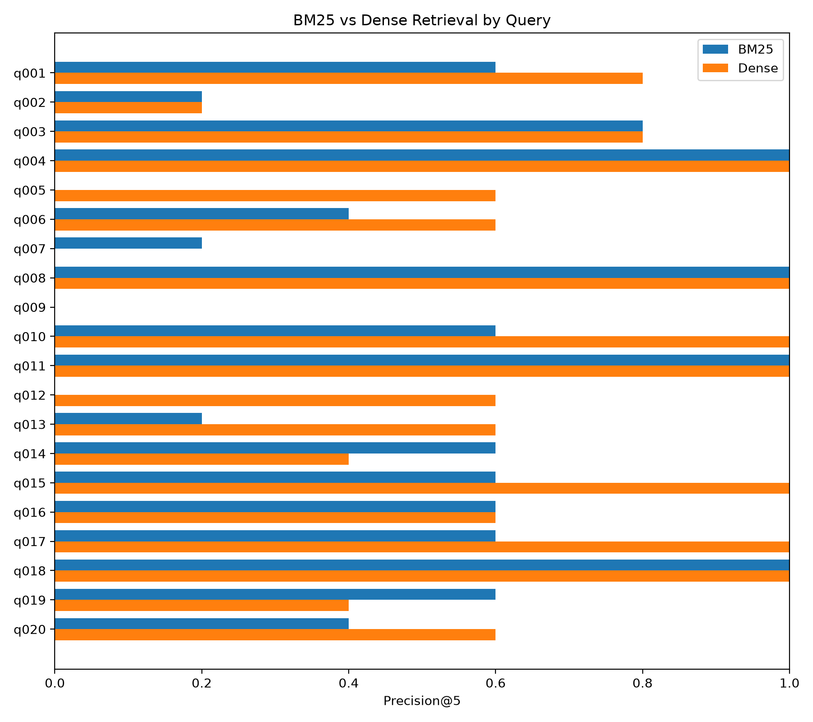

# Mathematical Literature Retrieval Benchmark

A reproducible information-retrieval benchmark for mathematical research literature.

The project compares **BM25 lexical retrieval** with **dense semantic retrieval** on a curated arXiv corpus, using manually defined mathematical information needs and human relevance judgments.

The guiding principle is:

> **Benchmark quality before model complexity.**

Rather than immediately building increasingly sophisticated retrieval models, the project focuses first on corpus quality, relevance assessment, reproducible evaluation, and qualitative error analysis.

---

## Current Benchmark

Benchmark v2 contains:

* **675 arXiv papers**
* **20 mathematical queries**
* **307 human relevance judgments**
* **BM25 lexical retrieval**
* **dense semantic retrieval**
* **system-blind relevance pooling**
* **Precision@5, RR@5, and MRR@5 evaluation**
* **qualitative retrieval-error analysis**

The original 104-paper / 5-query pilot benchmark is preserved separately as a frozen experimental snapshot.

---

## Headline Results

| Metric               |  BM25 |     Dense |
| -------------------- | ----: | --------: |
| **Mean Precision@5** | 0.520 | **0.660** |
| **MRR@5**            | 0.687 | **0.817** |

<p align="center">
  
</p>

On the current 20-query benchmark, the dense baseline performs better on both aggregate metrics.

These results are still treated as experimental rather than as general evidence that dense retrieval is universally superior for mathematical literature search. Query-level behavior varies substantially, and qualitative analysis reveals different failure modes for both systems.

---

## Retrieval Systems

### BM25

The lexical baseline uses `bm25s` with the Lucene-style BM25 implementation.

Current preprocessing is intentionally minimal:

* no stemming
* no stopword removal
* document representation: **title + abstract**

Example:

```bash
python src/search_bm25.py "geometric knot theory"
```

### Dense Retrieval

The dense baseline uses:

```text
sentence-transformers/all-MiniLM-L6-v2
```

Documents and queries are encoded as normalized vectors, with cosine similarity implemented through the dot product.

Example:

```bash
python src/search_dense.py "geometric knot theory"
```

Both retrieval systems operate on exactly the same document representation.

---

## Evaluation Design

Each benchmark query contains:

* a short search query;
* a written description of the underlying information need.

For example:

```text
Query:
Morse theory for variational problems
```

The description specifies what counts as relevant, including important inclusion and exclusion criteria.

Human judgments use binary relevance:

```text
1 = relevant
0 = non-relevant
```

Documents without judgments remain **unjudged** rather than being automatically treated as non-relevant.

---

## Relevance Pooling

Relevance candidates are constructed from the union of:

```text
BM25 top 5
    ∪
Dense top 5
```

Previously judged query-document pairs are removed.

The resulting candidates are presented to the assessor **without retrieval-system identity, rank, or retrieval score**.

This reduces the risk that knowledge of which system retrieved a paper influences the human relevance judgment.

Annotation is resumable and saved incrementally.

---

## What the Error Analysis Found

Aggregate metrics only tell part of the story.

Qualitative inspection revealed several distinct retrieval failure modes.

### 1. Lexical relation failure — BM25

For:

```text
Geometric Gradient flow
```

BM25 retrieved papers about:

```text
gradient estimates under geometric flow
```

These papers contained all three lexical signals — `gradient`, `geometric`, and `flow` — but expressed the wrong mathematical relationship.

After abstract-level relevance auditing:

```text
BM25:
P@5 = 0.000
RR@5 = 0.000

Dense:
P@5 = 0.600
RR@5 = 1.000
```

This is a clear example of lexical co-occurrence failing to capture mathematical composition.

### 2. Modifier failure — dense retrieval

For:

```text
Palais-Smale condition for geometric functionals
```

dense retrieval strongly captured the Palais-Smale concept but returned generic functional-analytic papers that failed the **geometric** restriction.

```text
BM25:
P@5 = 0.200

Dense:
P@5 = 0.000
```

Semantic retrieval therefore does not automatically enforce every restricting component of a query.

### 3. Shared retrieval failure

For:

```text
Topological methods in calculus of variations
```

both systems achieved:

```text
P@5 = 0.000
RR@5 = 0.000
```

However, deeper corpus inspection revealed relevant papers involving:

* Lusternik-Schnirelmann category
* minimax principles
* Morse index methods
* critical-point theory
* topological degree

The relevant material existed in the corpus, but neither baseline surfaced it near the top.

This also demonstrated an important limitation of shallow relevance pooling.

---

## Benchmark Versions

The project preserves two benchmark phases.

```text
data/
├── pilot/
│   ├── corpus/
│   └── eval/
│
└── benchmark_v2/
    ├── corpus/
    └── eval/
```

### Pilot

```text
104 papers
5 queries
```

The pilot is frozen and retained for reproducibility.

### Benchmark v2

```text
675 papers
20 queries
307 relevance judgments
```

The pilot papers are retained as a subset of v2 so that existing judgments can be reused where appropriate.

---

## Corpus Construction

Benchmark v2 was expanded using broad arXiv discovery searches covering areas including:

* geometric analysis
* calculus of variations
* critical-point theory
* geometric measure theory
* concentration compactness
* Morse theory
* harmonic maps
* minimal surfaces
* Sobolev inequalities
* free-boundary problems
* geometric flows
* Γ-convergence
* spectral geometry

These are deliberately broader than the exact evaluation queries.

This helps separate **corpus construction** from **benchmark evaluation**.

The resulting corpus contains:

```text
675 unique papers
0 missing titles
0 missing abstracts
0 duplicate base arXiv IDs
```

---

## Project Structure

```text
.
├── data/
│   ├── pilot/
│   └── benchmark_v2/
│
├── src/
│   ├── collect_arxiv.py
│   ├── expand_corpus.py
│   ├── inspect_corpus.py
│   ├── inspect_embeddings.py
│   ├── search_bm25.py
│   ├── search_dense.py
│   ├── evaluate_bm25.py
│   ├── evaluate_dense.py
│   ├── build_pool.py
│   ├── annotate_pool.py
│   ├── merge_pool_qrels.py
│   └── compare_rankings.py
│
├── docs/
│   ├── benchmark_design.md
│   ├── evaluation.md
│   └── error_analysis.md
│
├── requirements.txt
└── README.md
```

---

## Running the Project

Create and activate a virtual environment:

```bash
python -m venv .venv
source .venv/bin/activate
```

Install dependencies:

```bash
pip install -r requirements.txt
```

Inspect the corpus:

```bash
python src/inspect_corpus.py
```

Run retrieval:

```bash
python src/search_bm25.py "geometric knot theory"
python src/search_dense.py "geometric knot theory"
```

Run evaluation:

```bash
python src/evaluate_bm25.py
python src/evaluate_dense.py
```

Compare rankings for an individual query:

```bash
python src/compare_rankings.py q012
```

---

## Methodological Principles

The project emphasizes:

* **benchmark quality before model complexity**
* fixed and versioned experimental data
* identical document representations across retrieval systems
* explicit information-need definitions
* human relevance assessment
* multi-system relevance pooling
* system-blind annotation
* correct treatment of unjudged documents
* qualitative relevance auditing
* reproducible experimental milestones with Git

Detailed methodology is documented in `docs/`.

---

## Current Limitations

The benchmark is still relatively small.

The current top-5 relevance pool is sufficient for evaluating BM25 and dense retrieval at rank 5, but it is not deep enough to support strong exhaustive-recall claims.

Error analysis has already demonstrated that relevant papers can exist deeper in the corpus even when both baseline systems miss them.

For this reason, pooled recall is currently treated as provisional rather than as a headline metric.

---

## Next Steps

Near-term priorities:

1. deepen relevance pooling across the 20 queries;
2. continue relevance-judgment auditing;
3. add a query-level BM25 vs dense comparison visualization;
4. investigate additional ranking metrics;
5. stabilize the benchmark before increasing model complexity.

After that:

* hybrid lexical-semantic retrieval;
* stronger embedding models;
* mathematics-oriented retrieval models;
* reranking methods.

---

## Project Philosophy

The development process intentionally follows:

```text
small pilot
    ↓
validate methodology
    ↓
freeze pilot
    ↓
expand corpus and queries
    ↓
human relevance assessment
    ↓
quantitative + qualitative evaluation
    ↓
stabilize benchmark
    ↓
increase model complexity
```

The goal is not merely to produce a higher retrieval score.

The goal is to build an evaluation setting in which improvements to mathematical literature retrieval can be interpreted with confidence.
